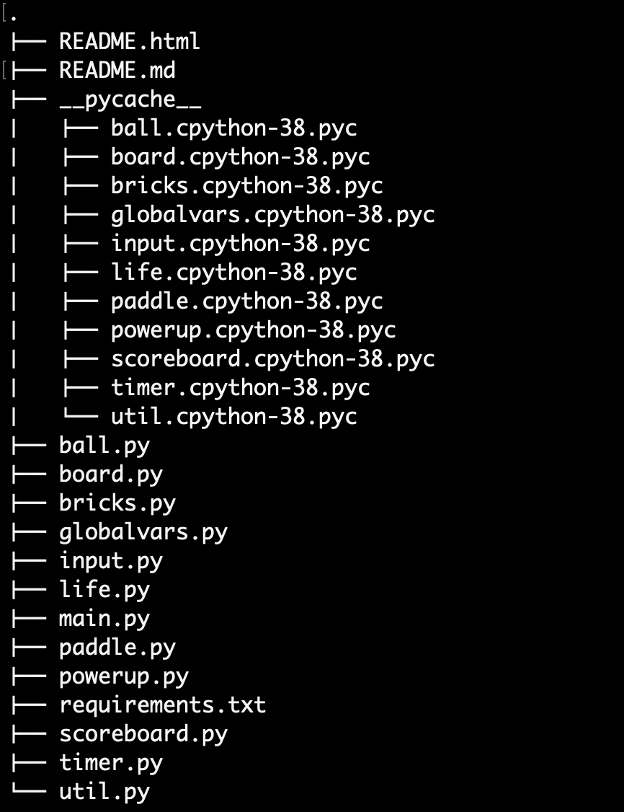

# **Terminal Brick Breaker**

## **Overview**

Terminal brickbreaker is a terminal version of the popular brick breaker arcade game which involves using Python3 and basic libraries to implenent it.

## **Concepts**

It uses various concepts from Object Oriented Programming such as:

`Polymorphism`: Some of the methods perform different functions for different classes and some functions are overwritten by subclasses. Eg: Display, move and damage.

`Abstraction`: All the methods for each object define the function but the exact functionality is hidden from the users and can be used as the user wants as long as the correct parameters are supplied.

`Encapsulation`: Class and object based approach for every element. Every element such as ball, paddle, brick, board, etc. is a class and has the required objects to implement the functionality.

`Inheritance`: Classes that import from other super classes because they have some common attributes. Eg: Bricks, powerups.

## **Running Instructions**

```bash
$ pip3 install -r requirements.txt
$ python3 main.py
```

## **Gameplay**

The game is played in a grid, defined by a Python array in a window of approximately the same dimensions as the terminal window. The positions of each object within this window are described as a set of `x` and `y` coordinate pairs, which can be mapped to the 2D array defined in the game board.

## **Game Components**

Each component of the game is a class, defined in an Python file with the name of the object in it. Each class contains the requisite methods required for that particular object, and in the main game, the components are instantiated as objects of that particular class. The interactions between objects are also define in different methods in both the classes. Additionally, all the components are represented using Unicode characters.

## **Controls**

Use `a` to move paddle left and `d` to move paddle right. Use `space` to launch ball and `q` to quit game. Ball can be launched only during the paddle attach powerup and during the start of each game or when a life is lost.

## **Scoring**

Scoring is assigned differently for each type of brick depending on the present strength of that brick. Low Level bricks are worth `10` points, medium level bricks give `10 X strength + 5` points for each hit and high level bricks give `10 X strength + 5` points for each hit. Score is displayed in an HUD at the top of the screen.

## **Lives**

There are three lives at the beginning of each game and whenever a life is lost the game resets. Lives are displayed by heart icons in an HUD on top of the screen. The number of icons reflects the number of lives.

## File Structure



